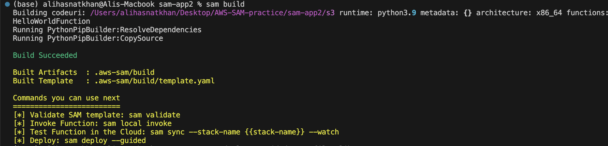
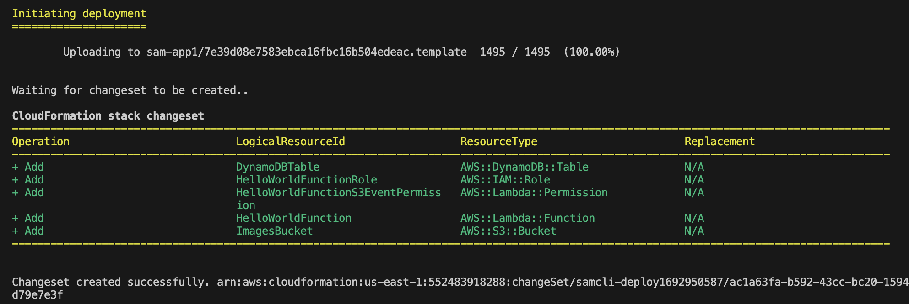
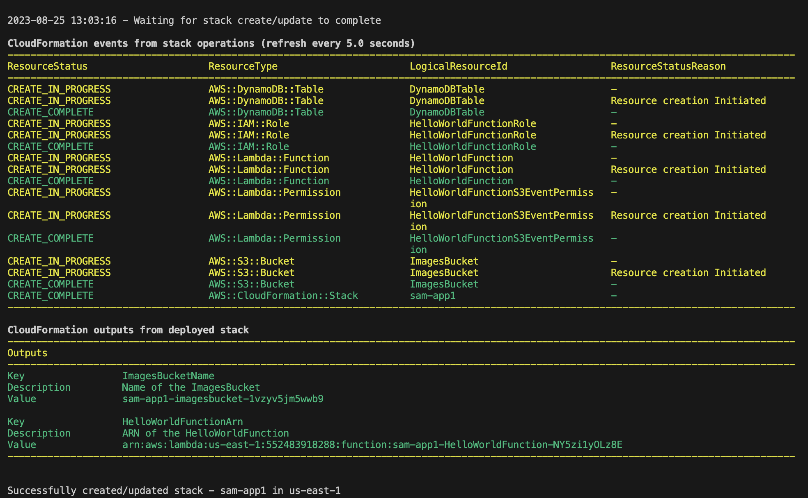

# Title: Text length Analyzer
#### Technologies used: 
AWS SAM, Lambda, S3, dynamoDB

#### Purpose: 
The project uses a lambda function to calculate the length of characters in a file. Whenever a text file is uploaded to s3, the lambda function is called. The lambda function calculates length and finally stores the file name and its content's length to dynamoDB.

## The project consists of three AWS services:
    1. S3: To upload text files which trigger an event.
    2. Lambda: Invokes the function when a file is uploaded to s3.
    3. dynamoDB: Lambda write the file's content's length to lambda.

## To Run:
1. Clone the project.
2. ```cd sam-app2```
3. Configure AWS (I have used the IAM identity provider): ```aws configure sso```  
4. ```sam build```
5. ```sam deploy --guided --profile aws_profile_name``` 
6. To delete: ```sam delete --stack-name sam-app1 --profile aws_profile_name```

## Screenshots:





